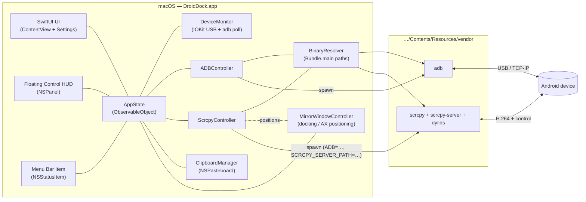

<div align="center">

# 🤖 DroidDock

**A production-grade, fully self-contained macOS app that mirrors and controls your Android device at up to 120 Hz.**

Built with SwiftUI + AppKit. Tuned for Apple Silicon (M-series) displays. No Homebrew, no `PATH` surgery, no manual `adb`/`scrcpy` installs — everything ships *inside the app bundle*.

</div>

---

> **Repository note.** This repository is named **DroidDeck**; the application
> product it builds is named **DroidDock**. That is intentional — the repo is the
> workspace, `DroidDock.app` is the artifact.

## Table of contents

- [What it does](#what-it-does)
- [Why it's "self-contained"](#why-its-self-contained)
- [Architecture](#architecture)
  - [High-level data flow](#high-level-data-flow)
  - [Module responsibilities](#module-responsibilities)
  - [Binary embedding & runtime path resolution](#binary-embedding--runtime-path-resolution)
  - [The "docked borderless mirror" approach](#the-docked-borderless-mirror-approach)
  - [Clipboard sync](#clipboard-sync)
- [Project layout](#project-layout)
- [Prerequisites](#prerequisites)
- [Build & run](#build--run)
- [Configuration & flags](#configuration--flags)
- [Code signing, hardened runtime & notarization](#code-signing-hardened-runtime--notarization)
- [Troubleshooting](#troubleshooting)
- [Roadmap / known limitations](#roadmap--known-limitations)
- [License](#license)

---

## What it does

| Feature | How |
|---|---|
| **Zero-install mirroring** | `adb` + `scrcpy` (and their dylibs/`scrcpy-server`) are embedded in `DroidDock.app/Contents/Resources/vendor` and resolved at runtime. |
| **Auto-connect on plug-in** | A USB connection watcher (IOKit) plus an `adb` device poller detect an authorized, USB-debugging-enabled device the moment it's attached and start the embedded ADB server. |
| **120 Hz mirroring** | `scrcpy` is launched silently with `--max-fps=120 --stay-awake --turn-screen-off` and a Metal render driver, inside a borderless window docked to the app frame. |
| **Native control HUD** | A floating, non-activating `NSPanel` of SwiftUI buttons (Home / Back / Recents / Volume / Power / Rotate / Screenshot / Record) that drive the phone via `adb shell input keyevent`. |
| **Bidirectional clipboard** | scrcpy's built-in clipboard forwarding **plus** a Mac-side `NSPasteboard` watcher that pushes/pulls text over `adb` so sync works even when the mirror isn't focused. |
| **Wireless ADB** *(extra)* | One click switches the device to TCP/IP (`adb tcpip` + `adb connect <ip>:5555`) for cable-free mirroring. |
| **Screenshot & record** *(extra)* | Instant screenshot via `adb exec-out screencap`; background screen recording via a dedicated headless `scrcpy --record` process. |
| **APK drag-and-drop** *(extra)* | Drop an `.apk` onto the window to `adb install -r`; drop any other file to `adb push` it to the device. |
| **Menu bar item** *(extra)* | An `NSStatusItem` for quick connect/disconnect, HUD toggle, and background operation. |

## Why it's "self-contained"

A normal scrcpy workflow assumes `brew install scrcpy` and an `adb` on your
`PATH`. DroidDock makes **no such assumption**:

1. **`scripts/fetch-binaries.sh`** downloads the *official* pre-compiled macOS
   builds — Google's `platform-tools` (for `adb`) and the Genymobile static
   `scrcpy` release (which bundles `scrcpy-server` and the `SDL2`/`ffmpeg`/`libusb`
   dylibs) — into `DroidDock/Resources/vendor/`.
2. This runs **both** as a one-shot setup command (`make setup`) **and** as an
   idempotent **pre-build Run Script phase**, so a clean `xcodebuild` always
   produces a fully-populated bundle.
3. At runtime, Swift never shells out to a bare `adb`/`scrcpy`. It resolves the
   embedded copies with `Bundle.main.path(forResource:ofType:inDirectory:)` and
   tells `scrcpy` where to find its helpers via the documented `ADB` and
   `SCRCPY_SERVER_PATH` environment variables.

The result: copy `DroidDock.app` to any Mac and it just works — no external
dependencies.

## Architecture

DroidDock is an **orchestrator**. It does not re-implement the scrcpy video
pipeline; it drives the official binaries as child processes and wraps them in a
premium native shell, while talking to the device directly over `adb` for
everything that doesn't need the video stream (buttons, clipboard, install,
wireless, screenshots).

### High-level data flow



### Module responsibilities

| Layer | File(s) | Responsibility |
|---|---|---|
| **Entry / lifecycle** | `App/DroidDockApp.swift`, `App/AppDelegate.swift` | `@main` SwiftUI `App`, `NSApplicationDelegate`, menu bar item, window setup. |
| **State** | `App/AppState.swift`, `Core/Models.swift` | The single `@MainActor ObservableObject` root that the UI binds to; device/connection models. |
| **Binary embedding** | `Core/BinaryResolver.swift` | Resolves embedded `adb`/`scrcpy`/`scrcpy-server` paths, ensures the executable bit, and builds the scrcpy child-process environment. |
| **Process plumbing** | `Core/ProcessRunner.swift` | `async/await` wrapper around `Foundation.Process` for both one-shot capture and long-lived streaming processes. |
| **Device** | `Core/ADBController.swift`, `Core/DeviceMonitor.swift` | All `adb` interactions (server, device list, key events, install, push, wireless, clipboard, screenshot) and connect/disconnect detection (IOKit USB events + a steady `adb devices` poll). |
| **Mirror** | `Core/ScrcpyController.swift`, `Windows/MirrorWindowController.swift` | Launch/terminate/auto-restart scrcpy with M-series-optimized flags; position & track its borderless window so it appears docked inside the app frame. |
| **Clipboard** | `Core/ClipboardManager.swift` | Background `NSPasteboard` watcher with best-effort `adb`-based push/pull, complementing scrcpy's own sync. |
| **UI** | `UI/*.swift`, `Windows/FloatingPanel.swift` | The premium borderless main window, the floating HUD, connection status, settings, and drag-and-drop. |
| **Support** | `Support/Logger.swift`, `Support/Preferences.swift` | `os.Logger` + in-app log ring buffer; `@AppStorage`-backed preferences. |

### Binary embedding & runtime path resolution

`BinaryResolver` is the contract between "where the bytes live" and "how Swift
calls them":

```swift
// Resolved with Bundle.main.path(forResource:ofType:inDirectory:)
//   …/Contents/Resources/vendor/adb
//   …/Contents/Resources/vendor/scrcpy/scrcpy
//   …/Contents/Resources/vendor/scrcpy/scrcpy-server
```

Because scrcpy's binary links its bundled dylibs via `@loader_path`, the whole
`scrcpy/` directory is copied verbatim (as an Xcode *folder reference*) so the
relative layout is preserved. When DroidDock spawns scrcpy it injects:

```
ADB=<vendor>/adb
SCRCPY_SERVER_PATH=<vendor>/scrcpy/scrcpy-server
```

so scrcpy uses *our* `adb` and *our* server push — never anything on the system.

### The "docked borderless mirror" approach

macOS does not support reparenting another process's window into your own view
hierarchy without fragile private APIs, and scrcpy renders into its own SDL
(Cocoa) window. So DroidDock takes the robust route used by shipping tools:

1. scrcpy is launched **borderless** (`--window-borderless`) with a known title
   (`--window-title=DroidDock-Mirror`) and an initial frame
   (`--window-x/-y/-width/-height`) computed from the app's main window.
2. `MirrorWindowController` keeps the mirror **docked**: it observes the app
   window's move/resize notifications and, if the user grants **Accessibility**
   permission, repositions the scrcpy window via the Accessibility API
   (`AXUIElement`) so it tracks the frame seamlessly. Without that permission it
   falls back to launch-time positioning + `--always-on-top`.
3. The SwiftUI chrome (title bar, status rail, drop target) and the floating HUD
   are drawn *around/over* the mirror, producing the "embedded panel" look.

A fully in-process renderer (decode scrcpy-server's H.264 with VideoToolbox into
a Metal layer) is documented as a future option in the roadmap.

### Clipboard sync

Two complementary mechanisms run together:

- **scrcpy autosync** (primary): left enabled, scrcpy copies the device clipboard
  to the Mac and vice-versa while the mirror has focus — the reliable,
  cross-Android-version path.
- **`ClipboardManager`** (background): polls `NSPasteboard.changeCount` and, when
  sync is enabled, pushes Mac text to the device and pulls device text using
  `adb shell cmd clipboard set-text/get-text` (best-effort; gracefully degrades on
  devices that restrict it). This keeps clipboards aligned even when the mirror
  window is not focused.

## Project layout

```
DroidDeck/                         # repository root
├── README.md  LICENSE  NOTICE.md  .gitignore
├── project.yml                    # XcodeGen spec — the project's source of truth
├── Makefile                       # setup / generate / build / run / sign helpers
├── scripts/
│   ├── fetch-binaries.sh          # downloads + ad-hoc-signs adb & scrcpy into vendor/
│   └── codesign-app.sh            # optional Developer-ID signing helper
└── DroidDock/                     # the SwiftUI/AppKit application
    ├── Info.plist
    ├── DroidDock.entitlements
    ├── App/        DroidDockApp · AppDelegate · AppState
    ├── Core/       BinaryResolver · ProcessRunner · ADBController ·
    │               DeviceMonitor · ScrcpyController · ClipboardManager · Models
    ├── UI/         ContentView · ControlHUD · HUDButton · ConnectionStatusView ·
    │               SettingsView · MirrorContainerView
    ├── Windows/    MirrorWindowController · FloatingPanel
    ├── Support/    Logger · Preferences
    └── Resources/
        ├── Assets.xcassets        # app icon + accent color
        └── vendor/                # ← populated by fetch-binaries.sh (git-ignored)
            └── .gitkeep
```

## Prerequisites

- **macOS 14 (Sonoma) or newer** — Apple Silicon recommended (tuned for M4 Pro).
- **Xcode 15+** with the command-line tools (`xcode-select --install`).
- **[XcodeGen](https://github.com/yonaskolb/XcodeGen)** — `brew install xcodegen`.
  The committed `project.yml` is the source of truth; the `.xcodeproj` is
  generated (and git-ignored) so there's never a merge-conflicted `pbxproj`.
- A network connection **for the first build only** (to fetch the binaries).
- An Android device with **USB debugging** enabled (`Settings → Developer options`).

## Build & run

```bash
# 1. Clone
git clone <this-repo> DroidDeck && cd DroidDeck

# 2. One command does everything: fetch binaries → generate project → build.
make            # == make setup generate build

# …or step-by-step:
make setup      # download + sign adb & scrcpy into DroidDock/Resources/vendor
make generate   # xcodegen generate  → DroidDock.xcodeproj
make build      # xcodebuild -scheme DroidDock -configuration Debug build

# 3. Open in Xcode to run/debug interactively:
make open       # xed DroidDock.xcodeproj   (then ⌘R)

# 4. Or launch the built app from the CLI:
make run
```

> The pre-build Run Script phase calls `fetch-binaries.sh` too, so even a raw
> `xcodebuild` (or hitting ⌘B in Xcode) on a fresh checkout self-provisions the
> vendor binaries. `make setup` just front-loads the download.

## Configuration & flags

Settings (⌘,) are persisted via `@AppStorage` and applied on the next mirror
launch. Defaults are tuned for an M4 Pro:

| Setting | Default | scrcpy flag |
|---|---|---|
| Max FPS | `120` | `--max-fps=120` |
| Keep device awake | on | `--stay-awake` |
| Turn device screen off | on | `--turn-screen-off` |
| Max size (longest edge, px) | `0` (native) | `--max-size=N` |
| Video bit-rate | `8M` | `--video-bit-rate=8M` |
| Forward audio | on | *(scrcpy default; `--no-audio` to disable)* |
| Render driver | `metal` | `--render-driver=metal` |
| Always on top | off | `--always-on-top` |
| Auto-mirror on connect | on | *(DroidDock behavior)* |
| Clipboard sync | on | *(scrcpy autosync + `ClipboardManager`)* |

## Code signing, hardened runtime & notarization

- The app uses the **Hardened Runtime** with
  `com.apple.security.cs.disable-library-validation = true` so it may load
  scrcpy's third-party dylibs, and **App Sandbox is intentionally disabled** —
  a tool that spawns embedded executables, binds the ADB port, and talks to USB
  cannot run sandboxed.
- `fetch-binaries.sh` **de-quarantines** (`xattr -dr com.apple.quarantine`) and
  **ad-hoc signs** (`codesign -s -`) every embedded binary/dylib so they execute
  on Apple Silicon, which refuses to run unsigned code. Doing this at fetch time
  (rather than post-build) keeps Xcode's outer signature valid.
- For local development, Xcode's automatic **"Sign to Run Locally"** is enough.
- For **distribution**, sign the embedded binaries and the app with your
  Developer ID and notarize — see `scripts/codesign-app.sh` and the comments
  therein.

## Troubleshooting

| Symptom | Fix |
|---|---|
| "device unauthorized" | Unlock the phone and accept the *Allow USB debugging?* prompt. DroidDock surfaces this state in the status rail. |
| Nothing happens on plug-in | Confirm USB debugging is on; some cables are charge-only. Check the in-app log (status rail ▸ Logs). |
| `scrcpy` won't launch | Run `make setup` again; verify `DroidDock/Resources/vendor/scrcpy/scrcpy` exists and is signed (`codesign -dv …`). |
| Mirror window doesn't track the frame | Grant **Accessibility** permission in *System Settings ▸ Privacy & Security ▸ Accessibility*. Without it, the window is positioned only at launch. |
| Clipboard pull doesn't work | Some Android builds restrict `cmd clipboard`. scrcpy's focused-window sync still works. |

## Roadmap / known limitations

- **True in-process rendering** (VideoToolbox + Metal) for a single-window
  experience without window-tracking.
- **x86_64 fallback** is wired into the fetch script (it picks the arch via
  `uname -m`), but the app is primarily validated on Apple Silicon.
- Window docking precision depends on Accessibility permission (see above).

## License

DroidDock's own code is **MIT** (`LICENSE`). The embedded `scrcpy` (Apache-2.0)
and Android `platform-tools` (Android SDK License) are downloaded at build time
and remain under their respective licenses — see [`NOTICE.md`](NOTICE.md).
